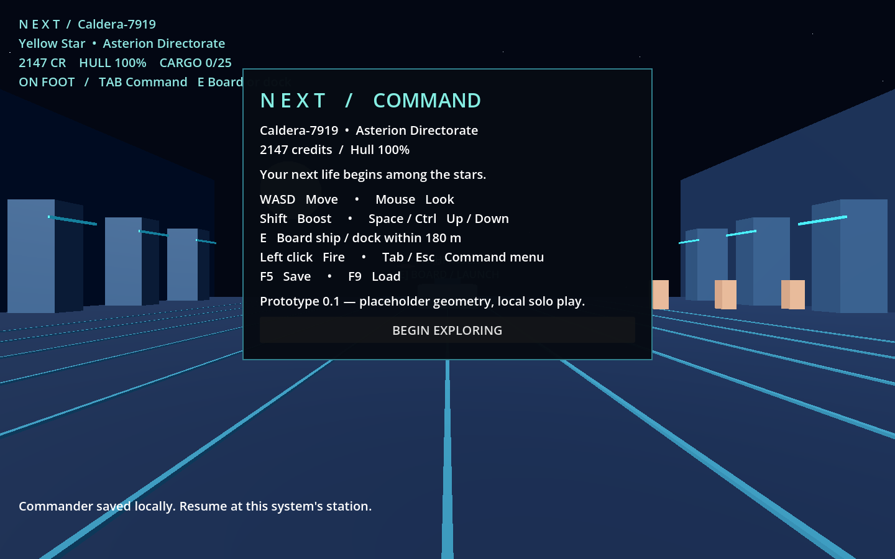

# NeXt

A space-age sandbox built in Godot. Explore, trade, fight, and eventually build a fleet, station, or faction of your own.

**Status: playable solo prototype 0.1, not a finished immersive sim.** Windows is the shipping target; Linux players will use Proton. Current visuals are code-built placeholder geometry, not representative of the intended final quality. No generated image, model, or audio assets are used.



## Play

Open `project.godot` in **Godot 4.7.2** and press **F6 on the main scene or F5**. Windows builds are available from the repository's Actions artifacts after a successful build. Extract the entire archive, keeping `NeXt.exe` and `NeXt.pck` together. For Proton, add the executable to Steam as a non-Steam game and select a Proton compatibility tool; target-platform runtime validation is tracked separately from export success.

| Control | Action |
| --- | --- |
| WASD / mouse | Walk or fly / look |
| Shift | Boost |
| Space / Ctrl | Jump on foot; ascend / descend in flight |
| E | Board from station / dock within 180 m |
| Left click | Fire |
| Tab or Escape | Command menu, navigation, trade, refit |
| F5 / F9 | Save / load |

Start in a station hangar. Practice firing at orange targets, press E to launch, and engage red pirate targets. Each pirate pays a 250-credit bounty. Nearby pirates cause periodic hull damage. Open the command menu to jump, then return within 180 m of the station and press E to dock. Trade commodities between systems, install cargo pods, and save your commander.

## Implemented

- First-person walking, jumping, practice-target shooting, arcade flight and hitscan ship combat.
- Deterministic generation across one billion system addresses, generated planet colors/atmosphere shells, faction labels, and station exteriors.
- Menu-based hyperdrive, commodity prices, cargo capacity, cargo-pod refits, repairs, bounties, and recovery fees.
- Versioned local JSON saves with temporary-file replacement. Reload resumes at the saved system's station; targets reset and ship position is not persisted.
- Windows export preset and CI. No external runtime plugins required.

## Deliberate prototype limits

Each system is a compact local scene with a 15 km flight boundary. Stars, neutron stars, black holes and nebulae currently use generic colored spheres; their names are generation metadata, not distinct physical simulations. Planets are decorative spheres without collision or landing. Stations have one walkable hangar and a generated outer silhouette. Pirates are stationary targets with proximity damage, not piloted ships. Factions are labels, not a political simulation. Re-entering systems respawns targets.

Steam multiplayer, cities, landable terrain, police AI, hireable NPCs, stocks, companies, freeform ship/station construction and VR **are not implemented**. See the [vision](docs/VISION.md), [roadmap](docs/ROADMAP.md), and [asset replacement checklist](docs/ASSET_CHECKLIST.md). Only ships and stations are intended to be craftable.

## Development and checks

```sh
godot --headless --path . --editor --quit
godot --headless --path . --script tests/test_universe.gd
godot --headless --path . -- --smoke
godot --headless --path . --export-release "Windows Desktop" build/windows/NeXt.exe
```

The smoke check exercises buy/sell, refitting, hyperdrive, shooting a pirate, and save/load. It uses a separate disposable save. With a display it also writes `build/preview.png`; create `build` before running the graphical check. Export requires the matching Godot templates. See [Godot's command-line documentation](https://docs.godotengine.org/en/stable/tutorials/editor/command_line_tutorial.html).

Local commander saves live in Godot's `user://commander.json` (on Windows, normally `%APPDATA%/Godot/app_userdata/NeXt/commander.json`). Steam Cloud is not configured. The game has no Steam networking integration or Steam App ID yet.

Code layout: `scripts/main.gd` owns the prototype loop and UI, `scripts/pilot.gd` owns movement, and `scripts/universe.gd` owns deterministic data. Keep galaxy addresses separate from scene coordinates. Split systems as actual gameplay grows, not in anticipation of hypothetical frameworks.
