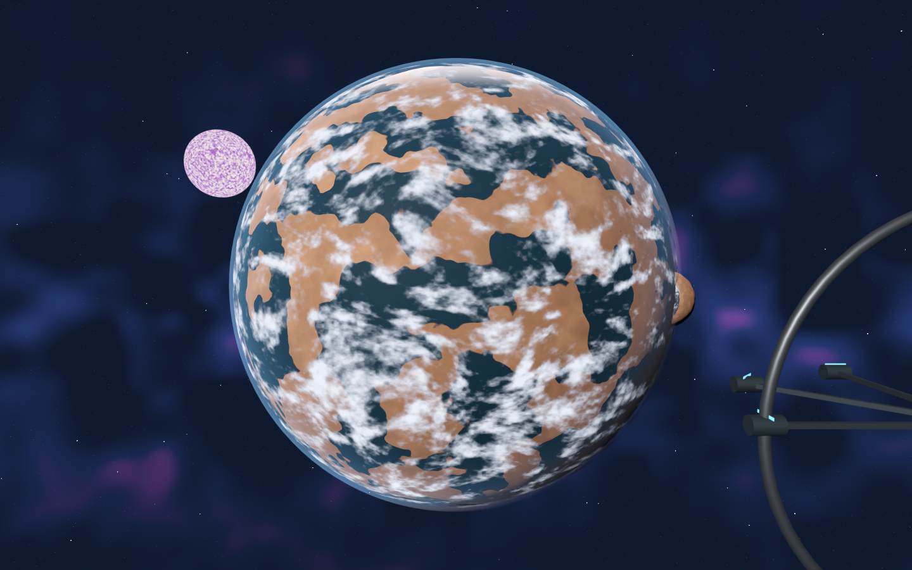

# NeXt

A first-person space-age sandbox built in Godot. Explore, trade, fight, build ships and stations, and establish a life in a human galaxy.

**Active development.** This is a working development build, not a finished AAA game. The agreed visual target is Star Citizen's believable ships and inhabited spaces combined with Elite Dangerous's cosmic scale. Current assets are replaceable procedural placeholders, and do not meet the final near-photoreal target.

## Agreed direction

Windows is the shipping target; Linux play uses Proton. The performance target is a high-end PC at 1440p/60 FPS. Travel should eventually be seamless and manual, with optional autopilot. Worlds pause when nobody hosts. Friends bring their ship and cargo while keeping world economies separate. The initial session target is 2–8 people, with owner permissions and consensual PvP. Only ships and stations are craftable. No hunger or thirst chores.

The [design decisions and questionnaire](docs/DESIGN_QUESTIONS.md) records the owner's answers. The [art direction](docs/ART_DIRECTION.md) and [asset checklist](docs/ASSET_CHECKLIST.md) define what the placeholders must become.

## Running

Open `project.godot` in **Godot 4.7.2** and press F5 (Run Project). On a Linux development machine with Steam Godot installed, `./run-next.sh` starts the project and `./run-next.sh --editor` opens its editor. Do not launch component `.gd` files with `--script`: files such as `network_session.gd` extend Node and need the main scene. Windows build artifacts are available from successful GitHub Actions runs. Extract the entire archive and keep the executable with its `.pck` file. On Linux, add the Windows executable to Steam and select Proton. The project uses Forward+ and Vulkan; `--rendering-method gl_compatibility` is an optional fallback with reduced lighting features.

For a hidden Linux validation of the Windows build, run `./tools/test-proton.sh`. It exports the current project, creates an isolated Proton prefix, and runs the normal game's smoke checks inside headless Gamescope. Use `./tools/test-proton.sh --crew` for the crew gameplay regression against the exported release executable; its setup and checks remain enabled in release builds. Evidence is retained under `build/proton-smoke.*`. Set `PROTON_BIN` or `STEAM_ROOT` for a different Steam installation, and `NEXT_SMOKE_TIMEOUT` for the runtime limit (90 seconds by default). A successful integration marker and a clean wrapper shutdown are reported separately; this is not a performance benchmark or a Steam multiplayer test.

| Control | Action |
| --- | --- |
| WASD / mouse | Move / look |
| Shift | Sprint or flight boost |
| Space / Ctrl | Jump or vertical flight |
| Q / R | Roll left / right |
| E | Talk to nearby officer, launch near ship, dock near station, or leave interior |
| F | Walk aboard your ship in flight or near its parked access; talk to crew inside |
| Left click | Fire |
| Tab / Escape | Command deck / return to world |
| J | Navigation |
| F5 / F9 | Save / load |
| Page Up / Page Down | Change decks while inside your ship |

Start in the orbital concourse. The ship is on the central pad. Approach it, press E, and launch. Use the command deck for navigation, trade, contracts, construction, hiring and company management. The calendar advances one day per 20 minutes of active world time, including menus; hyperdrive also advances one day. Daily salaries and company income follow this calendar, while assigned crew retain their operation timers. Closed worlds do not advance. Cruise autopilot handles local approaches, brakes when its body sweep detects an obstruction within stopping distance, and cancels when you take manual control. Flight collision follows the occupied 2.8 m ship module cells. Fast collisions damage shields and hull; fatal impacts leave a recoverable wreck and trigger rescue. Planetary approaches account for hull size, and ships too wide for a surface port must use open ground. Planet orbit and ground elevation share a seeded height map; surface approaches seek clear dry ground and manual landing rejects submerged or rock-obstructed sites. Seeded boulders retain their positions across terrain patches, with collision on larger rocks.

The ship architect supports cell coordinates from −16 to +16 on all axes, with a 100-module limit. Pan the grid or enter X, Z and deck coordinates; install/remove controls sit beneath the live preview. Assembly edits update ship statistics immediately.

## Implemented systems

- Assisted first-person walking and ship flight, acceleration, boost, local cruise autopilot, cockpit and held weapon.
- Moving pirate/security ships, ground NPCs, patrol/pursuit/retreat behavior, physics-ray combat, shielding, hull damage and bounties. Destroyed actor IDs persist by location.
- Floating-origin orbital flight keeps the player near zero across sector boundaries; distant local geometry/physics is culled and restored on return. Orbital flight addresses and helm orientation survive saves; wrecks and peer positions use sector addresses.
- One billion deterministic system addresses, procedural celestial visuals, station geometry, planet surfaces and colony districts. The generator creates data on demand rather than allocating a billion scenes.
- Connected grid-based ship assembly with live 3D preview, power/attachment/cargo checks, calculated mass, speed, weapons, shields and crew capacity.
- Walkable ship rooms derived from the installed modules when a habitat and sufficient connected hull exist. Rooms have collision, equipment, connecting doors and a deck selector. Grid-selected refits change compatible room fittings and exposed standard/armored/window panels. Room footprints and corridor placement are still derived from the module grid; panel refits currently change appearance rather than combat statistics.
- Commodity buy/sell, cargo capacity, fuel, repairs, delivery/exploration/bounty contracts, shares, hiring/dismissal, company treasury/dividends and station construction/upgrades.
- Player-founded factions with treasuries, paid affiliation of owned stations and diplomatic stances. Friendly/hostile relations affect personal commodity quotes and police hostility; criminal wanted status remains separate.
- Owned outposts have collision-supported docking decks: use Station works to approach, slow below 35 m/s within 65 m and press E to dock. Walk through the covered bridge into 3–8 service rooms, press E at a room terminal (or Tab for the command deck), and return to your ship to depart. Station walking positions and docked ships resume after loading.
- Named crew with persistent orders: trader captains operate escrow-funded routes on purchased fleet vessels, gunners fly local patrol ships that engage pirates with weapon rays and persistent hull damage (distant patrols use strategic encounter simulation), and engineers manage owned-station stock production. Fleet cargo, ship condition, work progress and assignments survive saves. Cancelled routes retain cargo; idle cargo can be sold, transferred between your personal and fleet holds at an orbital concourse, and station output collected through services.
- Commission a fleet copy of your current custom ship design at its module cost. Copies preserve rooms and panels, start with empty holds, and use their own geometry and stats for crew operations; sufficiently large designs can be inspected aboard. At an orbital concourse, take command of a local idle designed or custom vessel; the previous ship enters fleet storage with its own cargo, condition, fuel and identity. Utility vessels without saved blueprints cannot be piloted.
- Fleet work advances only while its world profile is active. Trade routes use timed orders. Local patrol ships physically fight pirates; distant patrols use strategic encounters. Assigned personnel do not also grant passive aboard-ship bonuses.
- Insurance, meaningful deductibles and recovery debt, persistent cargo wrecks, proximity-limited partial cargo recovery and single-use hull salvage. Medical rescue preserves the docked ship. Salvage settles debt first; insured salvage cannot exceed the claim deductible.
- Versioned validated local saves, legacy migration, persistent world identities and separate visitor economy profiles. Your home finances are preserved when returning with your ship and cargo.
- Experimental ENet world visits: validated ship exchange, player presence/pose synchronization, host-controlled interstellar travel and mutually opted-in ship combat. Enable PvP in Settings; both pilots must opt in and be flying. Consent resets on system travel or leaving. [Multiplayer details and limits](docs/MULTIPLAYER.md).

## Boundaries that still matter

The complete target is substantially larger than the implemented systems above:

- Manual landing on the existing small spherical planets now stays in the orbital scene: approach the surface, slow below 20 m/s, press E within 35 m, walk with radial gravity, and return to the ship to lift off. Navigation offers a surface approach autopilot. Ground saves preserve your walking position and parked ship separately. Cruise autopilot plans deterministic detours around planetary spheres, follows sector-addressed waypoints and returns control on manual input. It does not yet avoid buildings, ships or other traffic. Navigation now also offers colony approach to compact procedural surface ports in the same scene, with physical streets, ramps, a service terminal and docking. The older colony scene remains in code for compatibility; realistic planet-scale streaming, extensive cities, civilian schedules and manual hangar flight remain unfinished. Four port ground floors can now be entered directly to access trade, crew, ship services and contracts; upper floors remain closed. Each port has four named clerks and two security officers. Clerks remain at their posts, local guards respond to wanted status/diplomacy and follow baked routes through rooms, and casualties persist; distant staff simulation sleeps.
- Connected hosts can close new visitor admission or remove a guest from Settings. These per-session controls are validated over ENet; they are not persistent bans or property permissions.
- Steam lobby adapter code and lifecycle tests are present, but native Steam build configuration and a production AppID are still required. Real invites/relay, shared authoritative combat/economy, property permissions and durable transfer transactions are **not verified or complete**. Mutually opted-in flight PvP now passes ENet loopback checks; it is not yet verified over live Steam. ENet visits are an explicitly limited development feature, not finished Steam co-op.
- Freeform hull shaping, movable interior walls/furniture, physical trade routes, fleet wreck salvage and territorial sovereignty/negotiated diplomacy remain unimplemented. Current room and panel refits are bounded grid choices.
- Cities are generated colony districts; they are not complete populated urban simulations. Own-ship interiors remain vulnerable while coasting, including during visits. Shared cabin occupants and boarding another player's ship remain unimplemented.
- Orbital flight rebases across sectors without the former 28 km snap-back. Existing celestial bodies remain compact and presentation-scale; newly crossed space has no generated content yet. This is not a physically scaled or fully streamed galaxy.
- Local patrol positions reset when rebuilding a system; hull damage and orders persist. Disabled fleet ships are service-repaired, not yet salvageable wrecks.
- Menus pause local AI in solo play. NPC combat and economies remain independent during visits. Opted-in ship hits are host-validated, while target health and rescue remain local. Orbital flight saves resume their sector location and momentum; manual planet/port saves preserve ground positions, while legacy colony saves resume at the station.
- Current crew, police and company systems provide defined gameplay rules, not unrestricted human behavior. There is no claim that "everything" is implemented.

## Development checks

```sh
godot --headless --path . --editor --quit
godot --headless --path . -s tests/test_universe.gd
godot --headless --path . -s tests/test_state.gd
godot --headless --path . -s tests/test_calendar.gd
godot --headless --path . -s tests/test_calendar_gameplay.gd -- --capture-only
godot --headless --path . -s tests/test_actors.gd
godot --headless --path . -s tests/test_network.gd
godot --headless --path . -s tests/test_visit.gd -- --capture-only
godot --headless --path . -s tests/test_controls.gd -- --capture-only
godot --headless --path . -s tests/test_steam_session.gd
godot --headless --path . -s tests/test_faction.gd
godot --headless --path . -s tests/test_station_gameplay.gd -- --capture-only
godot --headless --path . -s tests/test_station_interior.gd -- --capture-only
godot --headless --path . -s tests/test_fleet_gameplay.gd -- --capture-only
godot --headless --path . -s tests/test_crew.gd
godot --headless --path . -s tests/test_recovery.gd
godot --headless --path . -s tests/test_ship_layout.gd
godot --headless --path . -s tests/test_sector_position.gd
godot --headless --path . -s tests/test_flight_frame.gd
godot --headless --path . -s tests/test_spatial_gameplay.gd -- --capture-only
godot --headless --path . -s tests/test_operations_gameplay.gd -- --capture-only
godot --headless --path . -- --smoke
godot --headless --path . --export-release "Windows Desktop" build/windows/NeXt.exe
```

Smoke checks use isolated disposable saves. Graphical `--visual-tour` additionally captures command, hangar, flight, shipyard, colony and interior frames in `build/` (or `user://` in exports). Visual tests run inside a hidden gamescope instance during Linux development. A passing headless check is not a graphics or performance verdict. Exporting requires matching Godot templates; see [Godot's command-line documentation](https://docs.godotengine.org/en/stable/tutorials/editor/command_line_tutorial.html).

Saves normally live at `%APPDATA%/Godot/app_userdata/NeXt/` on Windows. `commander.json` is the home world; `visits/<world-id>.json` stores foreign-world finances. Steam Cloud is not configured.

## Code and art ownership

`GameState` owns validated simulation and persistence. `SpaceWorld` generates environments. `Pilot`, `ShipActor` and `GroundActor` control movement/combat. `ShipVisual` and `ShipInterior` render ships. `NetworkSession` handles the current visit transport. `scripts/ui/` provides the command deck, map, construction editor and HUD. `main.gd` joins the systems.

No generated bitmap artwork is used. Procedural meshes, shaders and synthesized audio are placeholders implemented in code. Final authored replacements should preserve units, collision boundaries, pivots and functional attachment points.

Owned stations now provide a separate 120 m open berth for ships exceeding the compact pad envelope (32 m width/depth or 12 m height). Approach selects the suitable berth; use its marked service lane to board. The lane connects on foot to the station concourse.

Public orbital stations also assign oversized ships to an exterior 120 m berth, connected on foot to the hangar. Navigation cruise, docking, boarding, commander reload and hyperdrive arrival select its approach automatically. Public docking requires speed below 35 m/s.

Station Works supports editable service concourses: add up to 16 rooms, refit their service purpose, or salvage the last room. Changes persist in local saves and generate connected, numbered walkable rooms. Leave the station and multiplayer visits before editing its construction.

Walkable ship interiors occupy the ship’s actual position and orientation, with matching 2.8 m module spacing and gravity aligned to its deck. An engaged cruise route continues while you walk, carrying you through ship turns and stopping on arrival or when an obstacle blocks the route. Return to the helm to take control, or use Stop Cruise in the command deck. Without cruise, the ship coasts at its current velocity. Hull contact stops the coast and returns you to the helm, with collision damage and rescue where applicable.

Flight saves preserve ship velocity, including saves made from menus or while aboard. Loading resumes at the helm with that momentum; older saves without velocity start at rest. Closed worlds remain paused.

Space combat continues while you walk aboard: pirates and hostile police target your vessel, incoming fire damages its shields and hull, and destruction triggers rescue with a recoverable wreck. Walking away from the helm no longer freezes nearby ships or makes the vessel untargetable.

Hire a gunner and choose **Defend My Ship** in Crew Operations for autonomous defense at the helm or while aboard. The gunner uses exposed weapon modules, respects hull obstructions and external cover, and attacks hostile NPC ships within 720 m. Defense orders persist; wages are due every five hosted minutes, unpaid crew stop firing, and cancelling the order holds fire.

Editable floor and ceiling window panels now have transparent apertures with solid collision barriers. You can see outside while walking on the glass; room lights and trim no longer cover the opening.

Unassigned hired crew and your assigned ship gunner now appear aboard as named characters, where the layout has clear standing space (up to 12 bodies). Approach and press **F** to select their Crew Operations entry; **E** returns to the helm. Crew stay supported while the ship coasts, turns and crosses sector boundaries. Standing positions spread across available rooms: gunners prefer weapon modules, engineers engineering or workshops, and traders cargo. Clear alternative rooms provide a fallback, and crew face into their rooms. Unassigned engineers and traders now walk between reachable rooms using the actual cabin collision geometry, and use clear deck-transfer landings to reach other decks; gunners remain at their posts. Crew movement pauses in menus and during jumps. Crew keep right around nearby people and physically block one another and the aboard player; blocked routes pause and retry. Deck transfers currently use an assisted transition; physical elevator cabins and coordinated crowd scheduling remain unfinished. Fatal personal damage removes that crew member and ends their order; ship weapons strike the outer hull instead.

Ocean worlds with atmospheres now have separate, drifting procedural cloud shells with day/night lighting, plus a softer atmosphere limb. Clouds remain non-colliding and now dim the orbital and streamed terrain using the same weather pattern. Volumetric weather and cloud shading on buildings or vessels are not implemented.



Manual flight and cruise now use bounded thruster acceleration: 3 g normally, 6 g under manual boost. Cruise approach speed accounts for braking distance. The HUD displays translational **THRUST** load, including while walking aboard a cruising ship; free coasting reads zero. These are flight-assist tuning limits, not crew survivability claims. Cruise cancellation and obstacle avoidance brake over time, including in menus and across helm/interior handoffs. Obstacles are checked against stopping distance. Collisions still use simplified impulses; gravitational and rotational crew loads remain unimplemented.

Enable **Allow engineers to use cargo alloys for field repairs** in Enterprise to authorize repair supplies. Each paid, unassigned engineer can consume one alloy per day for up to eight hull points; partial repairs still use one unit. The policy defaults off, including for older saves. Full or destroyed hulls consume no supplies. Station repair services remain available.

Crew-operated fleet ships now spend their own fuel. Local thrust and braking consume impulse-based propellant; an empty tank preserves momentum. Intersystem fleet transfers cost 10 fuel for hyperdrive in addition to any local flight. Unrepresented same-system patrol/trade legs use a 2-unit estimate; represented same-system legs have no duplicate estimate. Fuel-short orders wait before wages or cargo transactions. **Dispatch Fuel Service** buys available fuel at the vessel's market; service arrival is currently abstracted.

**Quote Route** separates gross cargo margin from a round-trip operating estimate: two trader wages and replacement fuel for two jumps, priced at the origin market. If that market cannot supply replacement fuel, the operating estimate is unavailable. Local thrust, waiting/retry wages, repairs and price changes can reduce the actual return further. The quote does not purchase or reserve fuel.

Fleet traders unload as much cargo as the destination market can accept, retain the remainder at the berth, and retry on their normal order interval. Partial-sale reports show the realized cargo margin and remaining units. Purchase-cost allocation survives saves; wages still accrue on attempts, and the final unload/return leg still requires fuel.

**Find Profitable Routes** scans 32 consecutive system addresses from the selected address for the selected cargo quantity and an idle, empty fleet ship. It ranks up to five live estimates after wages and replacement fuel, bounded by available credits, origin stock and destination capacity. Select a result to fill the order form, then issue the order normally. Discovery does not reserve prices or goods and is not automatic rerouting or a galaxy-wide optimum.

**Adaptive Trade** assigns a trader to the selected commodity and quantity across the same 32-address range. Before every empty outbound trip it chooses the best current positive-margin destination that fits its reserved cargo capital. It does not draw additional purchase funding from commander credits; wages and existing fuel service allowances remain separate. If no viable route fits, it waits and retries on the normal interval. Cancel the order to recover unused capital. Prices can change during transit.

During criminal pursuit, **Allegiances & Law → Settle With Nearby Patrol** offers a peaceful fine payment while flying below 5 m/s within 350 m of an unobstructed living police ship. It preserves your ship, cargo and location and stops criminal hostility after payment. Insufficient funds, charging hyperdrive, diplomatic hostility and multiplayer visits block this option. Arrest, impoundment and criminal jurisdictions remain unfinished.

Parked hull families have a marked crew-access hatch and a walkable ramp. F still
enters the room adjoining the exterior hatch using the existing transition; opening airlocks, seamless boarding
and terrain-adjusting access gear remain unfinished.

Ship interiors use automatic telescoping bulkheads between different room roles.
Players and crew open them by approaching from either side; the doors stay open
while occupied and close after departure. These doors do not yet seal pressure,
support access permissions or respond to power failures.


You can walk inside your own ship while hosting or visiting a friend over ENet.
Other peers continue to see the exterior hull; NPC hits and consensual PvP hits
still damage that hull while you are away from the helm. Fleet inspections and
boarding another player's cabin are not yet supported during visits.
